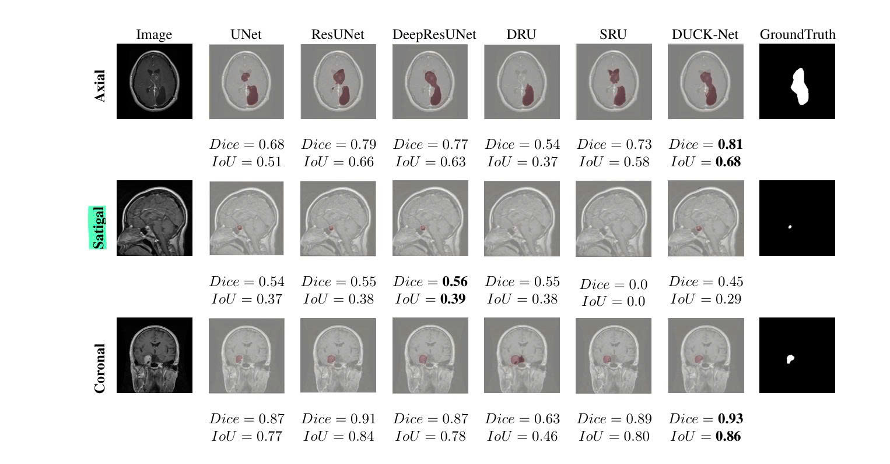

# Comparative-Analysis-of-Deep-Learning-Architectures-for-Brain-Tumor-Segmentation  

In this repository, six deep learning models were trained and evaluated for brain tumor segmentation.  
The models included:  
+ UNet: is a foundational architecture widely used in medical image segmentation  
+ ResUNet: is an UNet variant augmented with residual connections to strengthen feature learning  
+ DeepResUNet: is an extended ResUNet design emphasizing deeper feature extraction  
+ Recurrent UNet (SRU and DRU): is an improved UNet variant engineered to boost segmentation efficiency under resource constraints  
+ DuckNet: is a novel architecture optimized for segmentation through its distinctive dual-path design  

All models were trained on the same dataset and assessed using the Dice similarity coefficient and Intersection over Union  
As detailed in the paper "Comparative Analysis of Deep Learning Architectures for Brain Tumor Segmentation" by:  
+ Quang-Huyen Tran  
+ Hieu M. D. Pham  
+ Duy-Phuc Ho  
+ Hanh T. M. Tran  
From The University of Da Nang - University of Science and Technology, Vietnam. 
# Segmentation Dataset  
This is a standardized, publicly accessible brain tumor MRI dataset  
+ Source: [Figshare](https://figshare.com/articles/dataset/brain_tumor_dataset/1512427)  
+ Details: 3,064 MRI image-mask pairs (512×512 pixels, grayscale with binary masks)  
# Model segmentation visualization table  

# Comparison table of model effectiveness  
| Model         | Parameters | Train Dice | Train IoU  | Test Dice  | Test IoU   |
|---------------|------------|------------|------------|------------|------------|
| UNet          | 31.3M      | **0.9833** | 0.9577     | 0.8050     | 0.7232     |
| ResUNet       | 31.5M      | **0.9833** | **0.9674** | 0.8062     | 0.7233     |
| DeepResUNet   | 32.6M      | 0.9792     | 0.9597     | 0.8047     | 0.7235     |
| DRU           | 13.9M      | 0.9065     | 0.8301     | 0.7954     | 0.6699     |
| SRU           | **12.7M**  | 0.9260     | 0.8630     | 0.7825     | 0.6561     |
| DuckNet       | 38M        | 0.9753     | 0.9520     | **0.8575** | **0.7561** |
# Trained models  
Download pre-trained models: [Link](https://drive.google.com/drive/folders/1r9MbhVnNtbNW4zIUggwqQqw1P0Ob-fdV?usp=sharing) 
You can dowload pretrain model and fine turning in your task   

